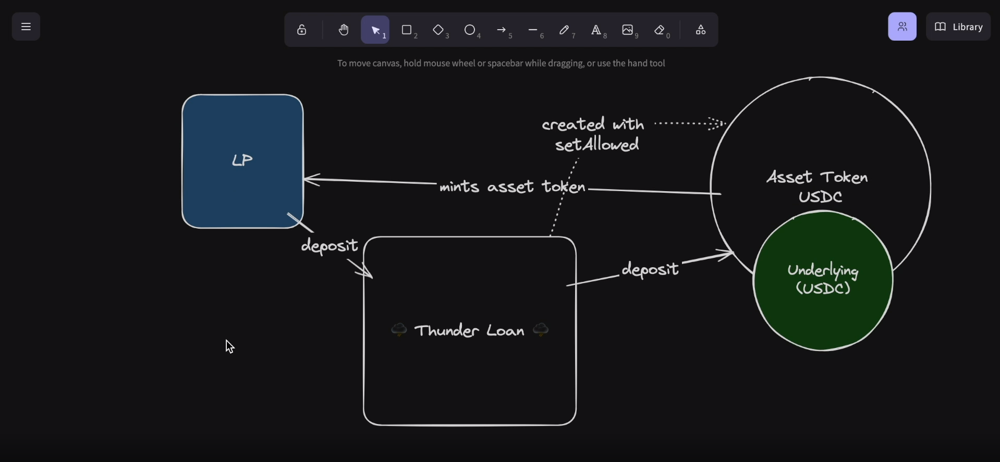
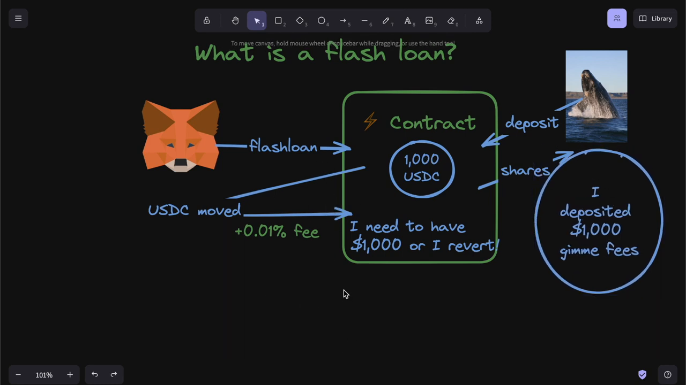
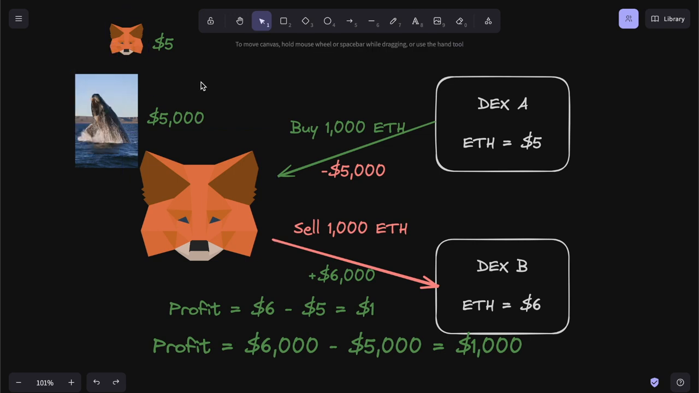
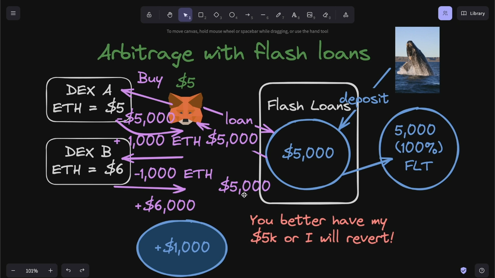
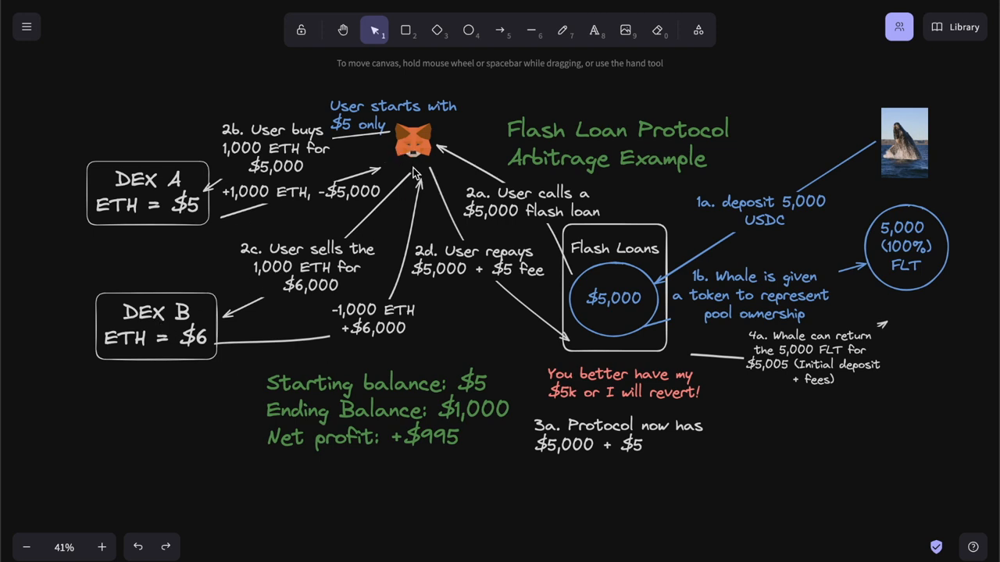

# ThunderLoan-Audit

- [Audit-Report](#audit-report-here)
- [What's Thunderloan](#whats-thunderloan)
- [What is a flash loan?](#what-is-a-flash-loan)
- [What is Arbitrage?](#what-is-arbitrage)
  - [Arbitrage with Flash Loan Explained](#arbitrage-with-flash-loan-explained)
- [FlashLoan-Recap](#flashloan-recap)

# Audit Report 

[Audit-Report-HERE](audit-data/report.pdf)

# What's Thunderloan
*(A flash loan protocol based on [Aave](https://aave.com/) and [Compound](https://compound.finance/))*

The ThunderLoan protocol is meant to do the following:

1. Give users a way to create flash loans.
2. Give liquidity providers a way to earn money off their capital.

Liquidity providers can `deposit` assets into `ThunderLoan` and be given `AssetTokens` in return. These `AssetTokens` gain interest over time depending on how often people take out flash loans!

# What is a flash loan? 

A flash loan is a loan that exists for exactly 1 transaction. A user can borrow any amount of assets from the protocol as long as they pay it back in the same transaction. If they don't pay it back, the transaction reverts and the loan is cancelled.

Users additionally have to pay a small fee to the protocol depending on how much money they borrow. To calculate the fee, we're using the famous on-chain TSwap price oracle.

We are planning to upgrade from the current `ThunderLoan` contract to the `ThunderLoanUpgraded` contract. Please include this upgrade in scope of a security review. 

# What is Arbitrage?

Suppose there is a `DEX A` and `DEX B` , User Bought `1000 ETH` for `$5000` and selled the `1000 ETH` to `DEX B` at `$6000` , coz the price of ETH was increased at the time of `DEX B`. Thus, gained a profit of `$1000`. This is known as arbitrage.

#### Arbitrage with Flash Loan Explained

# FlashLoan-Recap

